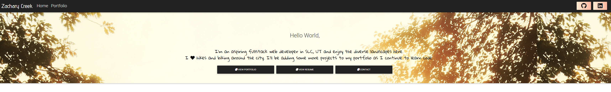

# Portfolio
These are all the projects I've worked on thus far. I've worked with MongoDB, Mongoose, MySql, Sequelize, Node, Handlebars, react, express, mdbreact, uikit, bootstrap and more! I'm excited to see where the coding world will take me and what creations I can build! This portfolio was built using node, express, react and mdbreact. I have some improvements to make towards more dynamic components and state management; however, I know I can only get better from here! [Click here](https://vivid-green.github.io/portfolio/) to view my portfolio website.

  
# Table of Contents
* [Portfolio](#Portfolio)
* [Description](#Description)
* [License](#License)
* [Questions](#Questions)

# License
This work is licensed under the following:
* [MIT](https://opensource.org/licenses/MIT)

# Questions

[Click Here to Visit my GitHub](https://github.com/vivid-green)

Email me with questions: zacharycreek@gmail.com
